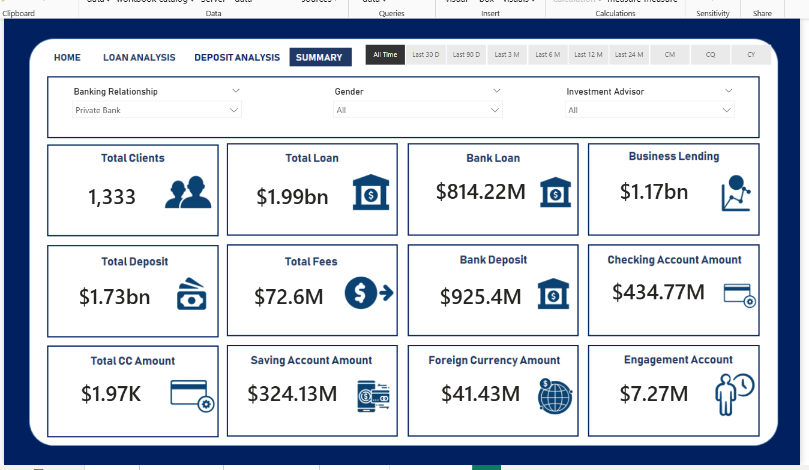
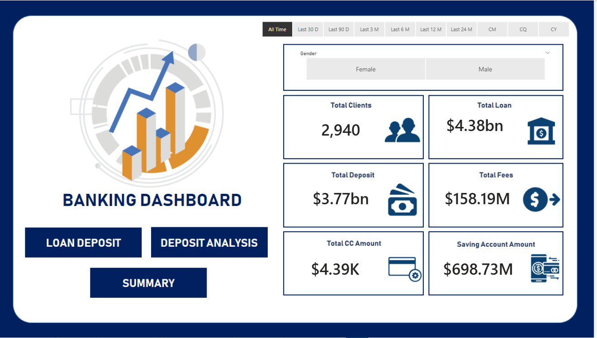
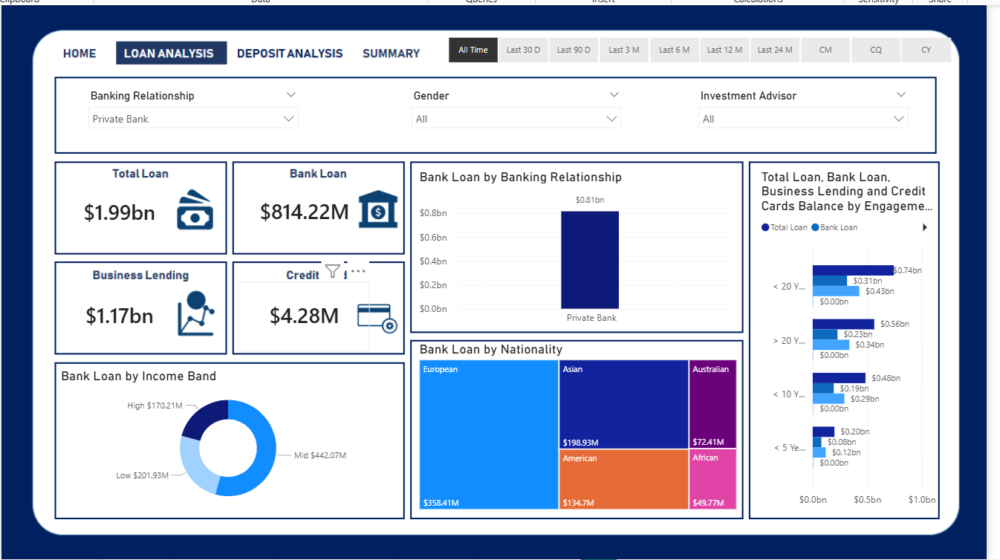
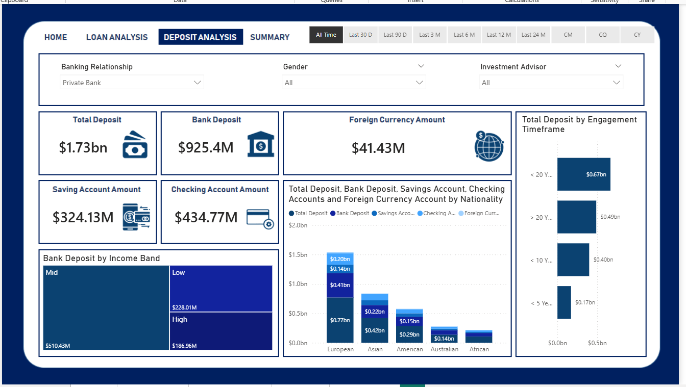

# 📊 Banking Risk Analytics Dashboard

A full-stack banking analytics project using **Power BI**, **MySQL**, **Python**, and **Excel** to analyze client behavior, assess loan risk, and create interactive dashboards for data-driven decision-making.



---

## 🧠 Problem Statement

Banks face increasing risk when lending to unqualified customers. The goal of this project is to develop a **risk analytics system** that helps financial institutions make smarter decisions on loan approvals based on historical banking behavior and customer profiles.

---

## 💡 Solution Overview

This project processes and analyzes relational banking data to:

- Assess loan default risk
- Segment clients by income and engagement
- Track and visualize key KPIs
- Support real-time loan decision-making through dashboards

The entire pipeline uses:
- **Excel** for initial data exploration
- **Python** for data cleaning and feature engineering
- **MySQL** for relational data querying
- **Power BI** for KPI dashboard development

---

## 💻 Technologies Used

- **Power BI** – Interactive dashboards and data visualizations
- **MySQL** – Data extraction, joins, and aggregations
- **Python (Pandas, NumPy)** – Preprocessing and custom metric creation
- **Excel** – Early-stage data analysis and profiling

---

## 📂 Dataset Overview

The project uses a multi-table relational database with the following key tables:

- `Client-Banking`
- `Banking Relationship`
- `Gender`
- `Investment Advisor`
- `Period`

These are joined using **primary and foreign keys**, following best practices in database normalization.

---

## 🧹 Data Cleaning & Feature Engineering

- Created new columns:
  - `Engagement Timeframe` – total client relationship length
  - `Engagement Days` – number of days from account start to today
  - `Income Band` – segmented income levels (Low, Mid, High)
  - `Processing Fees` – fee calculated based on loan size and fee structure

- Used **Python** for:
  - Merging and transforming raw data
  - Calculating DAX-ready columns for Power BI
  - Handling missing values and outliers

- Stored final cleaned data in **MySQL** for Power BI import

---

## 🧮 Key KPIs and DAX Metrics

| KPI                  | Description                                                       |
|----------------------|-------------------------------------------------------------------|
| `Total Clients`       | Count of unique client IDs                                        |
| `Total Loan`          | Bank Loan + Business Lending + Credit Card Balance               |
| `Total Deposits`      | Sum of Savings, Bank, Checking, and Foreign Currency Accounts     |
| `Processing Fees`     | Loan amount × processing rate                                     |
| `Engagement Days`     | Days between joining and today                                    |
| `Credit Card Balance` | Total current credit card debt across all clients                 |
| `Bank Deposit`        | Total deposited amount across bank accounts                       |

All KPIs were calculated using **DAX** formulas like `SUM`, `SUMX`, `DISTINCTCOUNT`, `DATEDIFF`, and `SWITCH`.

---

## 📊 Dashboards

### 🏠 Home Dashboard

High-level summary with filters by gender, nationality, and income band.



---

### 💰 Loan Analysis

Breakdown of loan type, amount, default risk, and credit balances.



---

### 🏦 Deposit Analysis

Visualization of client deposits across all account types.



---

### 📋 Summary Dashboard

Interactive summary with client segmentation, engagement, and advisor data.


---

## ✅ Insights & Observations

- 📈 **Private banks** have the highest client counts and total loans issued
- 💳 **Foreign nationals** tend to hold larger loan balances
- 🔄 **High-income clients** show longer engagement and more deposits
- ⚠️ **Processing fees** vary significantly by fee structure and loan type

---

## 🔭 Future Enhancements

- 💡 Integrate ML model to predict loan default risk
- 🌍 Add geo-level dashboard filtering (branch-wise performance)
- 🔔 Add Power BI alerts for flagged high-risk clients

---

## 📁 Project Structure

```
banking-risk-analytics-dashboard/
├── Banking Report.docx                # Final project report document
├── README.md                          # Project summary and documentation
├── Data/
│   └── clients_data.csv              # Cleaned or raw dataset
├── Power BI Dashboards/
│   └── banking_dashboard.pbix        # Power BI dashboard file
├── Images/
│   ├── home-dashboard.png            # Screenshot of Home Dashboard
│   ├── loan-dashboard.png            # Screenshot of Loan Analysis
│   ├── deposit-dashboard.png         # Screenshot of Deposit Analysis
│   └── summary-dashboard.png         # Screenshot of Summary Dashboard
├── Python Scripts/
│   └── data_cleaning.py              # Python script for data preprocessing
├── .gitignore                        # Git ignore rules
```


---

## 🙋‍♂️ Author

**Sandeep Yelikatte**  
Data Analyst | Power BI | Python | SQL | MySQL  
📧 sandeep@example.com  
🔗 [GitHub](https://github.com/sandeepgoud1215) | [LinkedIn](https://linkedin.com/in/your-profile)

---

## ⭐ If you found this helpful, feel free to give it a star!


